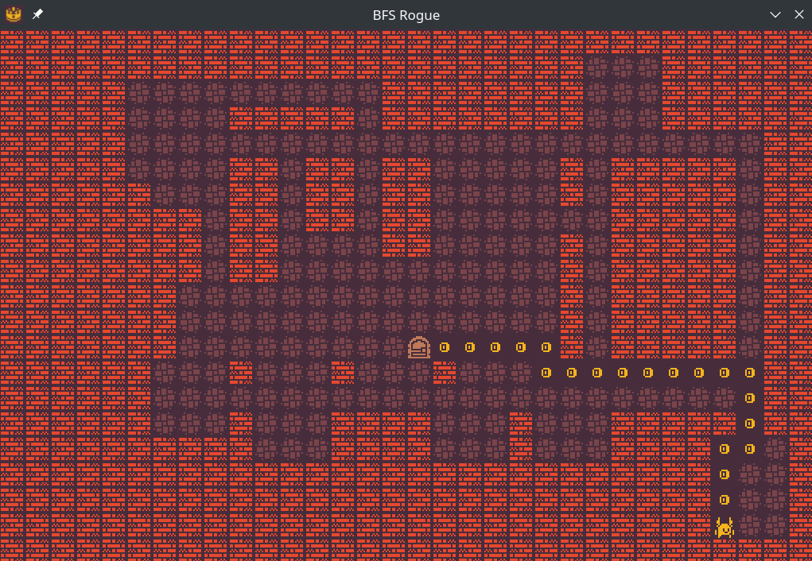

# BFS Rogue 😎
Visualisation of a breadth-first search algorithm with
simple map generation in C++ with SDL2. 🥰



### Build 🤓
- 💾 You need installed C++ compiler and download the [SDL2] dependency.
You can find instructions on how to install compiler and SDL2 into your
OS on the Internet. An example for Fedora Workstation:
```bash
sudo dnf install gcc-c++ SDL2-devel
```
- ⚒ Next, run the `cmake .` and `cmake --build .` to build.

### Tileset 🎨
I got the tileset from here: [1-Bit Pack]


[SDL2]: https://www.libsdl.org/
[1-Bit Pack]: https://kenney-assets.itch.io/1-bit-pack